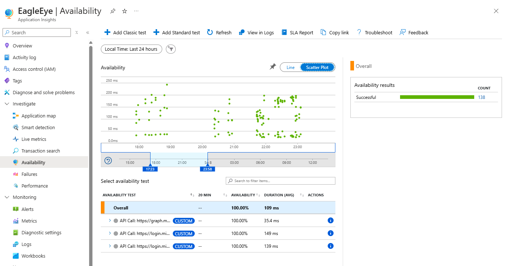

# 🦅 EagleEye-PowerShell-Insights - Monitor your PowerShell script like a pro!

Ever feel like your PowerShell script is running wild? 🤔 **EagleEye-PowerShell-Insights** is here to keep an eye on everything in real-time, showing you what’s really going on under the hood – all thanks to the power of **Azure Application Insights**!

To my knowlege there is no framework available for PowerShell

## 🔍 What does it do?

With **EagleEye-PowerShell-Insights**, you can monitor your PowerShell scripts with eagle-like precision (of course 🦅). It visualizes logs and data flows in a neural network-like style, so you not only see what's happening but actually get it!

## 🤔 Why did I create this?

As far as I know, there's no framework that integrates PowerShell projects with **Azure Application Insights** – at least not natively. Even Microsoft's own documentation (like [this article](https://learn.microsoft.com/en-us/azure/azure-monitor/app/app-insights-overview)) lists many supported languages such as ASP.NET Core, .NET, Java, Node.js, and Python... but **not** PowerShell. That’s where **EagleEye-PowerShell-Insights** steps in – to fill this gap and give PowerShell developers the monitoring tools they deserve!

## 🛠️ Real-world example – why you might need this

Imagine you have to loop through hundreds of Microsoft Tenants and Azure Subscriptions, processing each one with parallel jobs in **Azure Durable Functions**. The real challenge? Finding out where exactly an exception occurred in countless log streams across different Tenant Sessions. With **EagleEye-PowerShell-Insights**, you can easily track logs, associating them with the correct **tenant ID** and pinpointing the precise error message for debugging.

# 📂 Examples? We've got you covered!

## 🥇 Simple Example:

   ```powershell
   .\ExampleUsage_Simple_MainRun.ps1
   ```

## 🥈 Complex Example:

   ```powershell
   .\ExampleUsage_Complex_MainRun.ps1
   ```

## 🥉 Another Complex Example:

   ```powershell
   .\ExampleUsage_Recursive_MainRun.ps1
   ```

# 🌐 Visual Representation

EagleEye-PowerShell-Insights gives you the full monitoring experience with a visual map that looks like a neural network. Each node represents a part of your script. It’s not just cool, it’s practical too!

## 📸 Screenshots (because pictures speak louder than words)


## ⚙️ Prerequisites
1. A Microsoft Azure account with an Application Insights instance.
2. PowerShell 7+ (grab it here)

# 🚀 How to get started?

Before you take off, make sure you have PowerShell 7 (the latest and greatest), and then you're ready to roll.

The Usage of Eagly Eye is simple. You need to integrate it on all places where you want to have monitoring.

## 🔧 Setup & Usage

1. **Main Setup:**
    - Set your **Application Insights Variables** such as the connection string or instrumentation key.
    - Load the **Application Insights Modules** to ensure the telemetry functionality is ready.
    - Initialize the **Root Application Insights Activity** to create a base for logging all subsequent telemetry data.

2. **External Availability Checks:**
   - To monitor the availability of external dependencies (e.g., APIs, services), you can perform an **Availability Check** using Application Insights. This lets you verify whether external systems are reachable and functioning as expected, helping prevent external dependency issues from going unnoticed.

3. **Function Calls:**
    - Whenever you call a function, pass along the **Application Insights Activity** to maintain traceability across different functions. This allows you to track the flow of execution across your script.

4. **Function Execution Monitoring:**
    - To monitor specific functions, wrap the start and end of each function with an **Application Insights Dependency**. This measures the function’s performance and logs its execution time, helping you track the success and duration of your operations.

5. **External Calls:**
    - When making external calls, like **REST API Calls**, wrap these in **Application Insights Telemetry**. This will allow you to log external dependencies and capture their performance and any potential errors during execution.

6. **Logging:**
    - Send log messages to both **Console** and **Application Insights** by wrapping them in **Application Insights Telemetry**. This ensures that all logs are tracked and traceable across different systems and platforms for better debugging.

Now 🔧 Setup & Usage again but with examples:

1. **Main Setup:**
    - Set your **Application Insights Variables** such as the connection string or instrumentation key.

   ```powershell
   $ENV:APPLICATIONINSIGHTS_CONNECTION_STRING = "InstrumentationKey=xxxxxxxx-xxxx-xxxx-xxxx-xxxxxxxxxxxx;IngestionEndpoint=https://example-0.in.applicationinsights.azure.com/;LiveEndpoint=https://example.livediagnostics.monitor.azure.com/;ApplicationId=xxxxxxxx-xxxx-xxxx-xxxx-xxxxxxxxxxxx"
   ```
   
    - Load the **Application Insights Modules** to ensure the telemetry functionality is ready.

   ```powershell
   Get-ChildItem -Path "modules" -Filter *.psm1 -Recurse | ForEach-Object {
      Import-Module $_.FullName
   }
   ```

    - Initialize the **Root Application Insights Activity** to create a base for logging all subsequent telemetry data.

   Hint: CloudRoleInstance helps you to identify in Application Insights Logs the Instance of the Script. Text can be anything. It could be a TenantID or a Functionname.

   ```powershell
   $AppInsRootRequestActivity = New-EEAppInsActivity -CloudRoleName $currentFunctionName -AppInsParentActivity $null -CloudRoleInstance $ScriptName_OR_FunctionName_Or_somethingelse
   ```

2. **External Availability Checks:**
   - To monitor the availability of external dependencies (e.g., APIs, services), you can perform an **Availability Check** using Application Insights. This lets you verify whether external systems are reachable and functioning as expected, helping prevent external dependency issues from going unnoticed.

   ```powershell
   Confirm-EEDependencyEndpoint -Endpoint $service -AppInsParentActivity $AppInsRootRequestActivity
   ```

3. **Function Calls:**
    - Whenever you call a function, pass along the **Application Insights Activity** to maintain traceability across different functions. This allows you to track the flow of execution across your script.

   ```powershell
   -AppInsParentActivity $AppInsRootRequestActivity
   ```

4. **Function Execution Monitoring:**
    - To monitor specific functions, wrap the start and end of each function with an **Application Insights Dependency**. This measures the function’s performance and logs its execution time, helping you track the success and duration of your operations.

   Insert this at the beginning of each function:

   ```powershell
   $AppInsRequestActivity = New-EEAppInsDependency -AppInsParentActivity $AppInsParentActivity -CloudRoleName $MyInvocation.MyCommand.Name
   $ErrorActionPreference = "Stop"; trap {Send-EEAppInsExceptionLog -Exception $_ -AppInsRequestActivity $AppInsRequestActivity; return $null}
   ```

   Insert this at the end of each function:

   ```powershell
   Send-EEAppInsRequestLog -AppInsRequestActivity $AppInsRequestActivity
   ```

5. **External Calls:**
    - When making external calls, like **REST API Calls**, wrap these in **Application Insights Telemetry**. This will allow you to log external dependencies and capture their performance and any potential errors during execution.

   In this Example the original PowerShell command is Invoke-RestMethod. To Wrap this Command in Application Insights Telemetry you will need to create a wrapper function to enrich the call with telemetry data.

   ```powershell
   Invoke-EERestMethod -Uri $Uri -Method $Method -Body $Body -Headers $Headers -AppInsParentActivity $AppInsRequestActivity
   ```

6. **Logging:**
    - Send log messages to both **Console** and **Application Insights** by wrapping them in **Application Insights Telemetry**. This ensures that all logs are tracked and traceable across different systems and platforms for better debugging.

   In this Example the original PowerShell command is Write-Host or Write-Output. To Wrap this Command in Application Insights Telemetry you will need to create a wrapper function to enrich the call with telemetry data.

   ```powershell
   Write-EELog "Some Log Text" -AppInsRequestActivity $AppInsRequestActivity
   ```

# 🔍 Monitoring & Debugging Benefits

While **EagleEye-PowerShell-Insights** focuses on sending logs, the real magic happens within **Azure Application Insights** itself. Here are some benefits you can expect when using Application Insights for monitoring and debugging:

1. **Real-time Monitoring:**
    - Get a live feed of your logs, errors, and performance metrics, allowing you to react quickly to any issues as they arise.

   Why? Because of this:

   ```powershell
   Write-EELog "Some Log Text" -AppInsRequestActivity $AppInsRequestActivity
   ```


2. **End-to-End Traceability:**
    - Application Insights enables you to trace function calls, external dependencies, and log events across multiple components, giving you a holistic view of your system.

   Why? Because of this:

   ```powershell
   -AppInsParentActivity $AppInsRootRequestActivity
   ```


3. **Error Tracking:**
    - Automatically detect exceptions and failures with detailed stack traces, and correlate them with the user actions or specific operations that caused the issue.

   Why? Becuase of this:

   ```powershell
   $ErrorActionPreference = "Stop"; trap {Send-EEAppInsExceptionLog -Exception $_ -AppInsRequestActivity $AppInsRequestActivity; return $null}
   ```

   You'll see:
   - the trace
   - the logs
   - and the Operation Instance ID (which was important for me. In my case it was the TenantId which i used to identify the corresponding powershell Instance)
   - You will also see the FunctionName where the error happend, the codeline and much more.


4. **Performance Insights:**
    - Monitor the performance of your PowerShell scripts, external APIs, and dependencies to identify bottlenecks or latency issues.

   Why? Because of this:

   ```powershell
   $AppInsRequestActivity = New-EEAppInsDependency -AppInsParentActivity $AppInsParentActivity -CloudRoleName $MyInvocation.MyCommand.Name
   ```

   ```powershell
   Send-EEAppInsRequestLog -AppInsRequestActivity $AppInsRequestActivity
   ```


5. **Availability Checks:**
    - Regularly test the availability of external dependencies (e.g., APIs or services) with **Availability Checks**. This allows you to ensure critical systems are reachable and functioning, and to receive alerts if something goes down.

   Why? Because of this:
   ```powershell
   Confirm-EEDependencyEndpoint -Endpoint $service -AppInsParentActivity $AppInsRootRequestActivity
   ```



6. **Custom Dashboards & Alerts:**
    - Set up custom dashboards to visualize your logs and metrics, and configure alerts that notify you when certain thresholds are met, such as high failure rates or slow response times.

By leveraging **Azure Application Insights**, you’ll gain powerful tools for monitoring, troubleshooting, and optimizing your PowerShell scripts in real time.

# 😅 Warning

Be careful when working with recursive functions... sometimes things can get a little out of hand! Just take a look at this:


But hey, what's the fun without a little chaos, right? 😎

# 📜 License

EagleEye-PowerShell-Insights is licensed under the MIT License. See [LICENSE](LICENSE) for more information.